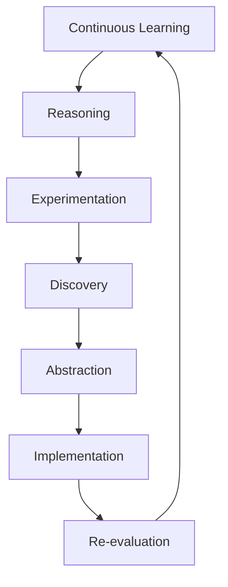

# Infinite: Autonomous Cognitive & Architectural Evolution Engine

> **System Profile:** EMG Core Neural Code & Documentation Optimizer  
> **Target:** Readability, Hierarchy, and Structural Standardization

---

## Overview

This repository defines an advanced cognitive architecture designed to transition artificial intelligence systems from static, fixed-persona interactions to self-directed capability acquisition. Rather than relying on rigid evaluation pipelines or isolated file mutations, the system models repository evolution as a continuous, closed-loop cycle of learning, reasoning, experimentation, and empirical discovery.

---

## Core Architectural Pillars

### 1. Dynamic Persona & Reasoning Loops

* **Infinite Specialist Generation:** Replaces fixed system personas with dynamically generated specialist perspectives tailored to specific task domains.
* **Recursive Metacognition:** Enables specialist agents to recursively instantiate, critique, refine, and retire other task-specific agents.
* **Non-Linear Evaluation:** Replaces sequential evaluation pipelines with an iterative, recursive reasoning loop.
* **Evidence-Based Conclusions:** Replaces hard-coded assumptions with model-generated conclusions derived from empirical data and verifiable execution outputs.

### 2. Knowledge Management & Memory Substrates

* **Persistent Long-Term Memory:** Logs discoveries, hypotheses, test runs, failures, and effective strategies over continuous execution cycles.
* **Unified Knowledge Substrate:** Maintains a shared operational state across research, reasoning, experimentation, and implementation modules.
* **Temporal & Semantic Indexing:** Combines repository-wide semantic indexing with temporal tracking to record historical system modifications.
* **Knowledge Compression:** Converts recurrent discoveries into reusable architectural abstractions to mitigate context bloat.
* **Contradiction Management:** Detects logical inconsistencies within accumulated memory and triggers state updates as new evidence emerges.

### 3. Research & Experimentation Engines

* **Empirical Validation:** Executes combined web and repository queries alongside continuous compilation, program execution, and benchmarking.
* **Hypothesis & Experimentation:** Generates testable explanations and verifies them against source code, computational simulations, and performance metrics.
* **Uncertainty & Causal Tracking:** Quantifies uncertainty across claims, hypotheses, and architectural modifications using causal dependency models rather than surface correlations.
* **Autonomous Agendas:** Formulates self-directed research schedules focused on unresolved queries and capability gaps.

### 4. Evolutionary Development & Multi-Step Planning

* **Multi-Step Objectives:** Formulates and applies code modifications as coordinated, multi-step operations rather than uncoordinated single edits.
* **Competing Hypotheses:** Maintains parallel architectural hypotheses concurrently, applying evolutionary selection mechanisms to retain top-performing variants.
* **Automated Rollback:** Executes systematic rollbacks and iterative refinements when modifications fail to meet validation criteria.
* **Distributed Orchestration:** Employs event-driven orchestration and distributed execution workers with checkpointed state management.

---

## System Evolution Pipeline

The execution flow of the Infinite engine follows a continuous recursive cycle:



```text
Continuous Learning
  └── Reasoning
        └── Experimentation
              └── Discovery
                    └── Abstraction
                          └── Implementation
                                └── Re-evaluation
```

---

## Objective

The objective of **Infinite** is to establish self-directed capability acquisition, enabling repository and architectural evolution through continuous autonomous research, execution, and empirical verification.