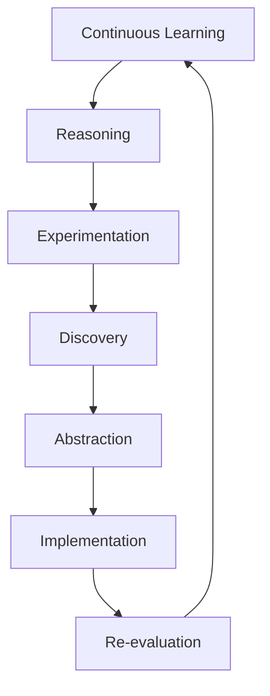

# Infinite: Autonomous Cognitive & Architectural Evolution Engine

| Attribute | Specification |
| :--- | :--- |
| **System Profile** | EMG Core Neural Code & Documentation Optimizer |
| **Optimization Target** | Readability, Structural Hierarchy, and Standardization |
| **Architecture Type** | Self-Directed Cognitive & Architectural Evolution Engine |

---

## Overview

**Infinite** is a cognitive architecture designed to transition artificial intelligence systems from static, fixed-persona interaction models to self-directed capability acquisition. Rather than relying on rigid evaluation pipelines or isolated file mutations, the system models repository evolution as a continuous, closed-loop cycle of learning, reasoning, experimentation, and empirical discovery.

---

## Core Architectural Pillars

### 1. Dynamic Persona and Reasoning Loops

* **Infinite Specialist Generation:** Replaces fixed system personas with dynamically generated specialist perspectives tailored to specific task domains.
* **Recursive Metacognition:** Enables specialist agents to recursively instantiate, critique, refine, and retire task-specific sub-agents.
* **Non-Linear Evaluation:** Replaces sequential evaluation pipelines with an iterative, recursive reasoning loop.
* **Evidence-Based Conclusions:** Derives conclusions from empirical execution data and verifiable program outputs rather than static heuristics.

### 2. Knowledge Management and Memory Substrates

* **Persistent Long-Term Memory:** Logs discoveries, hypotheses, execution runs, failures, and effective strategies across continuous operational cycles.
* **Unified Knowledge Substrate:** Maintains a shared operational state across research, reasoning, experimentation, and implementation modules.
* **Temporal and Semantic Indexing:** Combines repository-wide semantic indexing with temporal tracking to record historical system modifications.
* **Knowledge Compression:** Converts recurring discoveries into reusable architectural abstractions to mitigate context window expansion.
* **Contradiction Management:** Detects logical inconsistencies within accumulated memory and updates state as new empirical evidence emerges.

### 3. Research and Experimentation Engines

* **Empirical Validation:** Executes combined web and repository queries alongside continuous compilation, program execution, and benchmarking.
* **Hypothesis Generation and Testing:** Formulates testable explanations and evaluates them against source code, computational simulations, and runtime performance metrics.
* **Uncertainty and Causal Tracking:** Quantifies uncertainty across claims, hypotheses, and architectural modifications using causal dependency models rather than surface correlations.
* **Autonomous Agendas:** Formulates self-directed research schedules focused on resolving open queries and capability gaps.

### 4. Evolutionary Development and Multi-Step Planning

* **Multi-Step Objectives:** Formulates and executes code modifications as coordinated, multi-step operations rather than isolated single edits.
* **Competing Hypotheses:** Maintains parallel architectural hypotheses concurrently, applying evolutionary selection mechanisms to retain top-performing variants.
* **Automated Rollback:** Executes systematic rollbacks and iterative refinements when modifications fail to meet validation criteria.
* **Distributed Orchestration:** Employs event-driven orchestration and distributed execution workers with checkpointed state management.

---

## System Evolution Pipeline

The execution flow follows a continuous recursive loop across seven core operational phases: continuous learning, reasoning, experimentation, discovery, abstraction, implementation, and re-evaluation.



```text
Pipeline Execution Hierarchy:
Continuous Learning
  └── Reasoning
        └── Experimentation
              └── Discovery
                    └── Abstraction
                          └── Implementation
                                └── Re-evaluation
```

---

## Objective

The primary objective of **Infinite** is to establish self-directed capability acquisition, enabling continuous repository and architectural evolution through autonomous research, execution, and empirical verification.